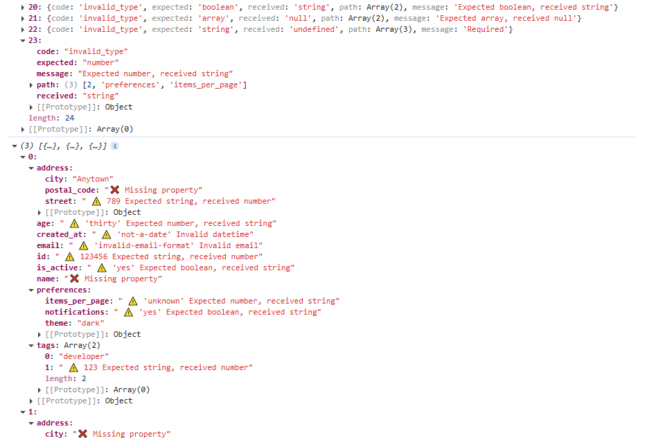

# core-zod-schema-validator

Plugin for API testing to validate API responses against ZOD schemas. It can be used directly in any project.




## Main Features

- Function **`validateSchemaZod()`** to report Zod validation errors in the response obtained from any network request.
  
- The schema is provided as a Zod object.

- Provides the full list of errors as delivered by the Zod package, and a user-friendly view of the mismatches between the validated data and the Zod schema, highlighting where each validation error occurred and the exact reason for the mismatch

- Relies on the **Zod Schema Validator** as its powerful core engine for schema validation.


## About ZOD Schemas and Ajv JSON Schema Validator

### ZOD Schema

A Zod schema is aTypeScript-first schema declaration and type generator that ensures data conforms to a specific structure and types at runtime. It is used to validate and infer TypeScript types for objects, arrays, and other data constructs.

### ZOD Schema Validator

The Zod Schema Validator plugin is a tool used to define, validate, and ensure data structures conform to predefined schemas according defined Zod Schemas. It helps developers validate data at runtime while seamlessly integrating with TypeScript for type inference, ensuring consistent and error-free data handling across applications.

For more information on Zod, visit the [Zod official website](https://zod.dev/).

&nbsp; 


## Installation

```sh
npm install -D core-zod-schema-validator
```


## Compatibility

- TypeScript 4.5+
- You must enable strict mode in your `tsconfig.json`. This is a best practice for all TypeScript projects.


## API Reference

### `validateSchema(data, schema[, issuesStyles])`

Function that validates the given JSON data against the provided Zod schema.

#### Parameters

- **`data`** (required)
  - **Type:** `any`
  - **Description:** The data to be validated.

- **`schema`** (required)
  - **Type:** `object`
  - **Description:** Zod schema to validate against.
    See the [Zod Schema documentation](https://zod.dev/) for more information.

- **`issuesStyles`**  (optional)
  - **Type:** `object`  
  - **Description:**  An object with the icons used to flag the schema issues. If not provided, it will use the default icons defined in the plugin. Includes the following properties:
    - **`iconPropertyError`**: The icon used to flag type errors in the data.
    - **`iconPropertyMissing`**: The icon used to flag missing properties in the data.


#### Returns

An object containing the following properties:

- **`errors`**  
  - **Type:** `array`  
  - **Description:** An array of validation errors as provided by Zof, or `null` if the data is valid against the schema.

- **`dataMismatches`**  
  - **Type:** `object`  
  - **Description:** The original response data with all schema mismatches directly flagged.

- **`issuesStyles`**
  - **Type:** `object`  
  - **Description:**  Object `issuesStyles` used to flag schema issues in `dataMismatches` results.


#### Throws
- **Error:** If any of the required parameters are missing.

Example providing a ZOD schema:

```js
  //...
  const data = response.body
  const { errors, dataMismatches } = validateSchemaZod(data, schema);
  expect(errors).to.be.null; // Assertion to ensure no validation errors
  //...
```

## Usage Examples

### Example: Using `validateSchemaZod` Function in Cypress Test Framework

```js
/// <reference types="cypress" />

import { z } from "zod";
import { validateSchemaZod } from 'core-zod-schema-validator'

// Definition for the "Category" object
const categorySchema = z.object({
  id: z.number().int(),
  name: z.number().optional(), // Optional as per schema
  color: z.string()
});

// Definition for the "Tag" object
const tagSchema = z.object({
  id: z.number().int(),
  name: z.string(),
  type: z.string()
});

// Definition for the "Pet" object
const petSchema = z.object({
  id: z.string().optional(), // Optional as per schema
  age: z.number().int(),
  category: categorySchema.optional(), // Optional as per schema
  name: z.number(), // Defined as integer in the schema
  photoUrls: z.array(z.string()).min(2), // Minimum of 2 items
  tags: z.array(tagSchema).min(1).optional(), // Optional as per schema, min 1 item.
  status: z.enum(["available", "sold"]) // Specified as enum
});

const schema = z.array(petSchema);


describe('API Schema Validation Function', () => {

  const customIssuesStyles = { iconPropertyError: '⛔', iconPropertyMissing: '❓' }

  it('Test Zod Schema - Sample 2', () => {
      const findByStatusReq = {
          url: 'https://petstore.swagger.io/v2/pet/findByStatus?status=pending',
          headers: { 'Content-Type': 'application/json' }
      }

      cy.request(findByStatusReq).then((response) => {
          const result = validateSchemaZod(response.body, schema, customIssuesStyles)
          expect(result.errors).to.be.null
      });
  })
});
```
 

## License

This project is licensed under the MIT License. See the [LICENSE](LICENSE) file for more details.


## Changelog

### [1.0.0]
- Initial release.

### [1.0.1]
- Update wrong URLs in package.json.


## Support

If you'd like to support my work, consider buying me a coffee or contributing to a training session, so I can keep learning and sharing cool stuff with all of you. Thank you for your support!

<a href="https://www.buymeacoffee.com/sclavijosuero" target="_blank"></a>
